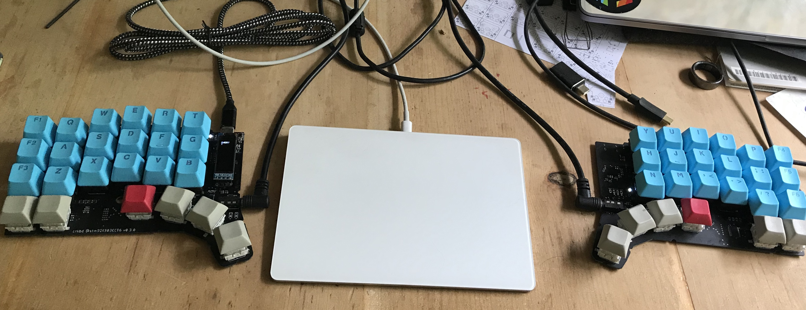
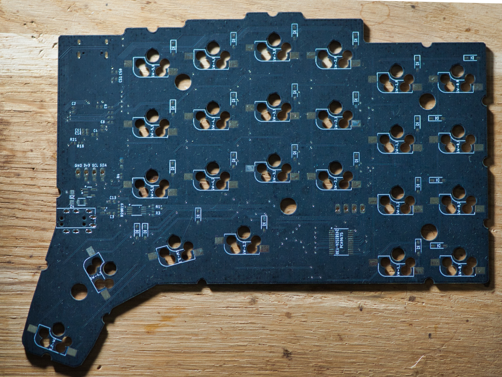

# kepler
the kepler keyboard. An ARM based, split, ergonomic keyboard

# features 

- OLED support (SSD1306 compatible)
- ARM based (STM32F303CCT6)
- QMK supported
- flippable PCB
- hotswappable switches (using kailh-mx sockets)
- 0402 components

# qmk setup

- clone qmk
- add kepler as a submodule: `git submodule add https://github.com/nicolai86/kepler.git keyboards/kepler`
- flash your kepler: `make kepler/rev1:default:dfu-util`

# images of rev 0.3 (qmk rev1)

