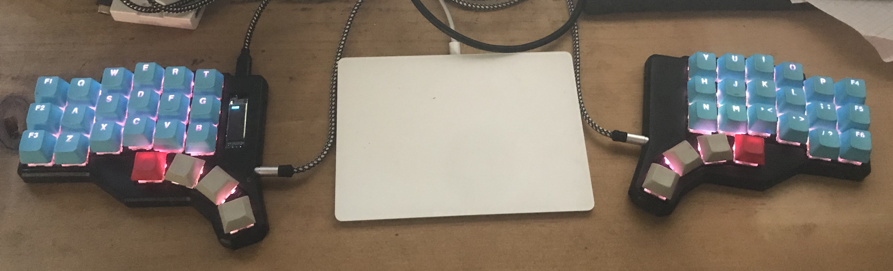

# Ganymede
the Ganymede keyboard. An ARM based, split ergonomic keyboard.

## changelog 

### v0.5 / rev3

<ul style="list-style-type: none; margin: 0; padding: 0;">
    <li>+ choc support</li>
    <li>+ I2C eeprom (M24M01)</li>
    <li>- cherry mx support</li>
</ul>

### v0.4 / rev2

<ul style="list-style-type: none; margin: 0; padding: 0;">
    <li>+ per key RGB backlight</li>
    <li>+ 9 RGB underglow</li>
    <li>+ fully enclosed, 3d printable case with tenting support</li>
    <li>- flippable PCB</li>
</ul>

### v0.3 / rev1

<ul style="list-style-type: none; margin: 0; padding: 0;">
    <li>&#8226; OLED support (SSD1306 compatible)</li>
    <li>&#8226; ARM based (STM32F303CCT6)</li>
    <li>&#8226; QMK supported</li>
    <li>&#8226; flippable PCB</li>
    <li>&#8226; hot-swappable switches (using kailh-mx sockets)</li>
    <li>&#8226; mostly 0402 components</li>
</ul>

# qmk setup

- clone qmk 0.8
- add ganymede as a submodule: `git submodule add https://github.com/nicolai86/ganymede.git keyboards/ganymede`
- flash your ganymede: `make ganymede/rev3:default:dfu-util`
