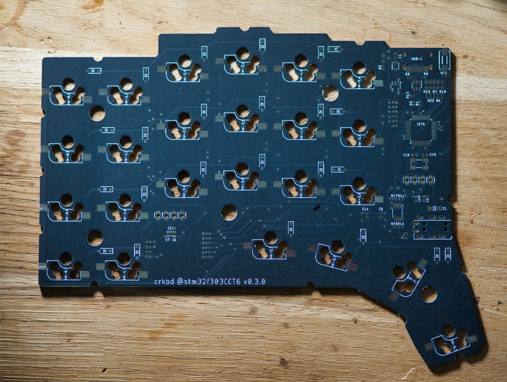

# Ganymede
the Ganymede keyboard. An ARM based, split ergonomic keyboard.

# rev 0.3 

## features

- OLED support (SSD1306 compatible)
- ARM based (STM32F303CCT6)
- QMK supported
- flippable PCB
- hotswappable switches (using kailh-mx sockets)
- 0402 components

## qmk setup

- clone qmk
- add ganymede as a submodule: `git submodule add https://github.com/nicolai86/ganymede.git keyboards/ganymede`
- flash your ganymede: `make ganymede/rev1:default:dfu-util`

## images 

