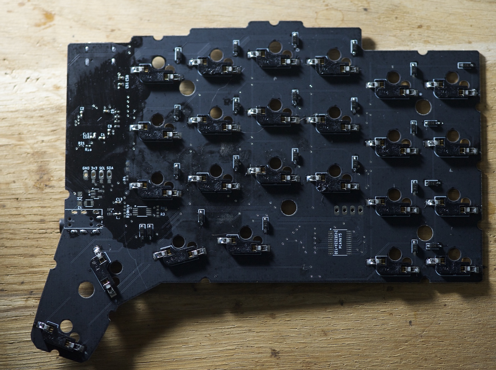
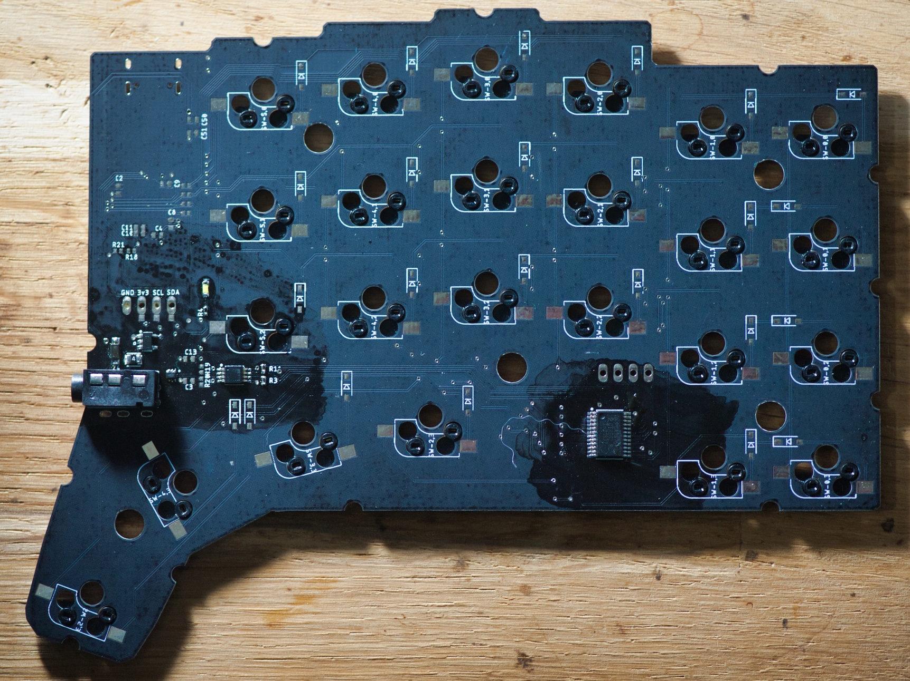
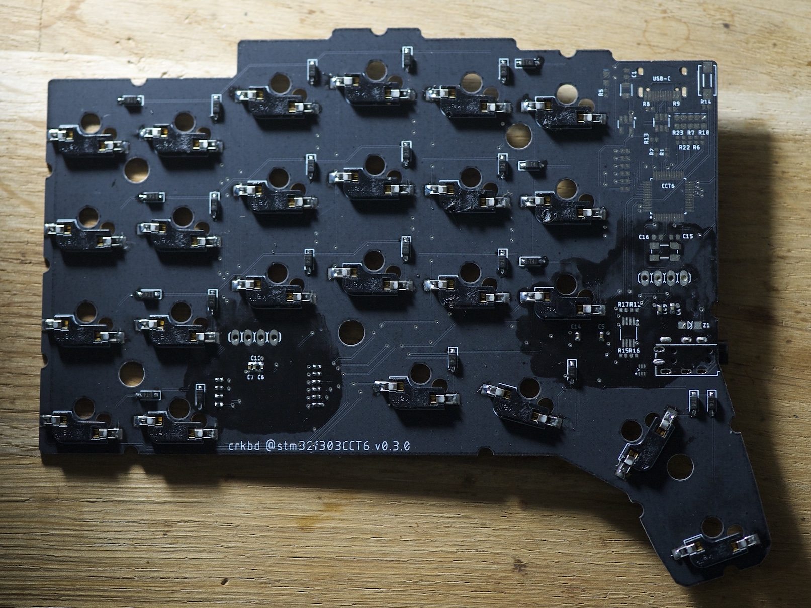

# revision 0.3

There is no build guide for rev 0.3 for now; See the assembled pictures for details; 
The gerber files for this revision are available in [gerber.zip](./gerber.zip).

Note that all decoupling capacitors are placed on the opposite side.

## left side (master)

### top

important:
- capacitor for USB is placed on top
- resistors for primary I2C bus are placed on top
- resistors for the columns of the key matrix are placed on top

### bottom

important:
- all MX sockets are placed on the bottom
- all diodes are placed on the bottom
- capacitors for voltage regular are placed on the bottom
- capacitors for STM32F303 are placed on the bottom
- capacitors for PCA9617A are placed on the bottom
- resistors for second I2C bus are placed on the bottom
- resistors for the rows of the key matrix are placed on the bottom

## right side 

### top

important: 
- resistors for primary I2C bus are placed on top

### bottom

important:
- all MX sockets are placed on the bottom
- all diodes are placed on the bottom
- capacitors for PCA9617A are placed on the bottom
- capacitors for PCA9675 are placed on the bottom
- capacitors for voltage regular are placed on the bottom
- all resistors for the key matrix are on the bottom

## Bill of Materials

|Qty|Value                     |Device                    |Package              |
|---|:------------------------:|:------------------------:|:-------------------:|
|7  |LED0603                   |LED-0603                  |0603                 |
|1  |PINHD-1X4                 |1X04                      |                     |
|2  |3.5JACK320A               |3.5JACK320A               |PJ-320A              |
|9  |100nF                     |C-USC0402                 |0402                 |
|1  |10nF                      |C-USC0402                 |0402                 |
|6  |1uF                       |C-USC0402                 |0402                 |
|2  |22pf                      |C-USC0402                 |0402                 |
|2  |4.7uF                     |C-USC0402                 |0402                 |
|1  |ABM3B                     |ABM3B                     |5X3.2                |
|1  |switch                    |DTSM-3                    |DTSM-3               |
|48 |MX-SOCKET                 |MX-SOCKETSWITCH_PLATE     |MX-SOCKET-3P         |
|48 |1N4148                    |1N4148                    |SOD123               |
|1  |OLED                      |PINHD-1X4                 |1X04                 |
|2  |PCA9617A                  |PCA9617ATSSOP8            |TSSOP8               |
|1  |PCA9675                   |PCA9675SOP24              |SOP24                |
|2  |PSMD050                   |PSMD0500805               |0804                 |
|1  |STM32F302_303CCT6         |STM32F302_303C2LQFP48-7X7 |TQFN48               |
|2  |TPD2E1B06                 |TPD2E1B06                 |SOT                  |
|1  |TYPE-C-31-M-12            |TYPE-C-31-M-12            |TYPE-C-31-M-12       |
|1  |USBLC6-2SC6               |USBLC6-2SC6               |SOT-23-6L            |
|2  |XC6201                    |XC6201                    |SOT95P270X110-5      |
|2  |ZENER                     |ZENER-DIODESOD123         |SOD123               |
|25 |470                       |R-US_R0402                |0402                 |
|2  |5k1                       |R-US_R0402                |0402                 |
|2  |22                        |R-US_R0402                |0402                 |
|1  |10k                       |R-US_R0402                |0402                 |
|2  |1k                        |R-US_R0402                |0402                 |
|8  |1k4                       |R-US_R0402                |0402                 |
|1  |1k5                       |R-US_R0402                |0402                 |

You can find all parts on either lcsc.com or mouser.
