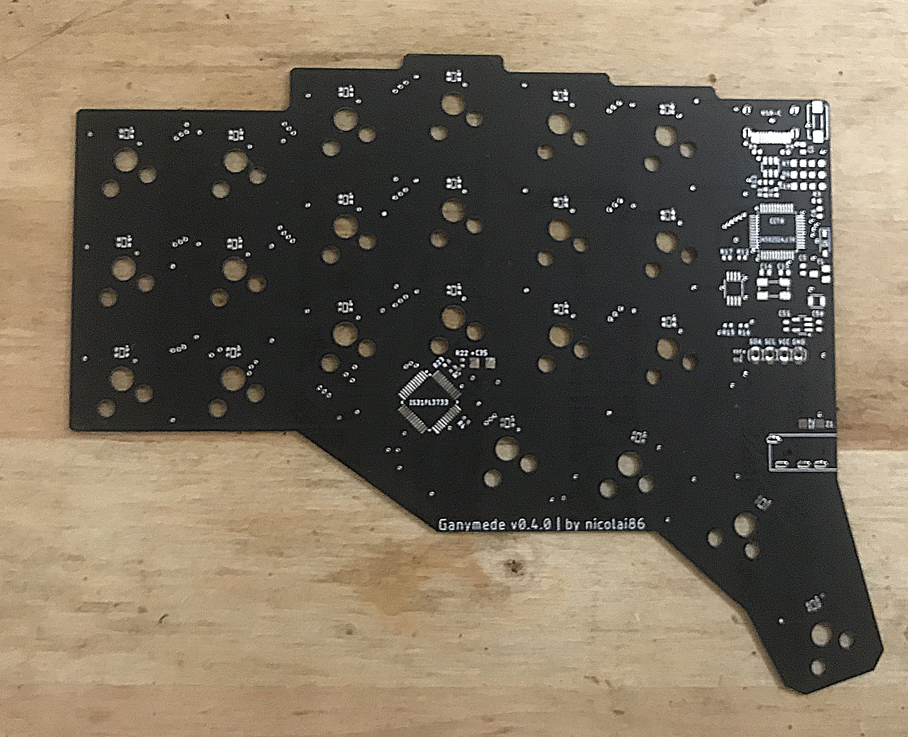
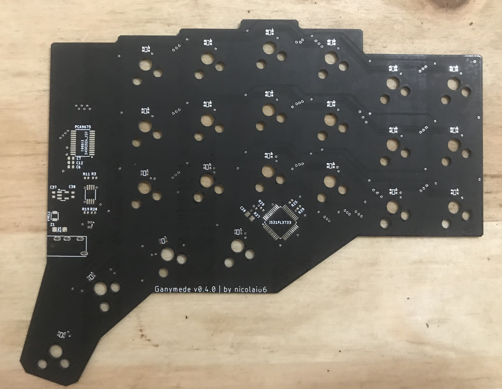

# revision 0.4

There is no build guide for revision 0.4 as it is mostly identical to revision 0.3;
The gerber files for this revision are available: [left hand (v0.4.1)](./left-0.4.1.zip) and [right hand (v0.4.0)](./right-0.4.0.zip).

## left side

## right side 

## case

This revision comes with a fully enclosed case which can be 3d printed. [STL](./case-v0.4.zip).
I've successfully 3d printed the case using ABS with the following resolution and 100% infill each:

- [left top (100μm)](./case-v0.4/2-1x-left_upper-original.stl)
- [left bottom plate (200μm)](./case-v0.4/1-1x-left_plate-original.stl)
- [right top (100μm)](./case-v0.4/4-1x-right_upper-original.stl)
- [right bottom plate (200μm)](./case-v0.4/3-1x-right_plate-original.stl)

## Bill of Materials

- [left side](./ganymede-v0.4-left-side.bom.csv)
- [right side](./ganymede-v0.4-right-side.bom.csv)

You can find all parts on either lcsc.com or mouser.

