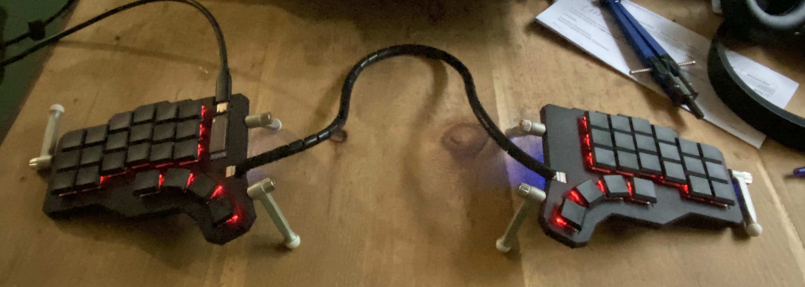

# revision 0.5

There is no build guide for revision 0.5; the gerber files are not yet available.
Also, there is no bill of material available yet.

## image

## case

This revision comes with a fully enclosed case which can be 3d printed. [STL](./case/v0.1.zip).
I've successfully 3d printed the case using SLS with Nylon 12:

- [left top](./case/left-top.stl)
- [left bottom plate](./case/left-bottom.stl)
- [right top](./case/right-top.stl)
- [right bottom plate](./case/right-bottom.stl)
